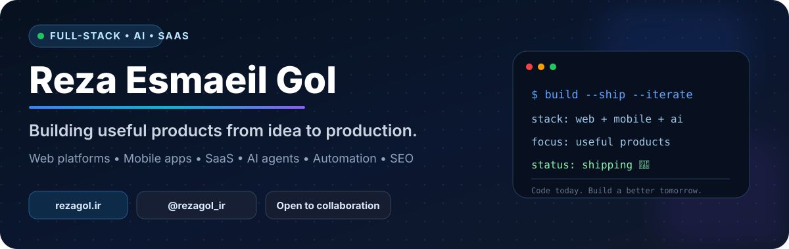
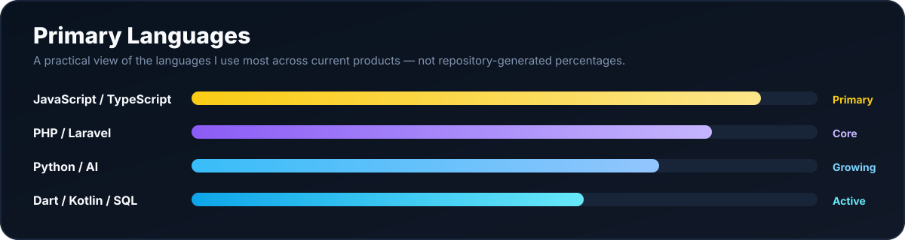
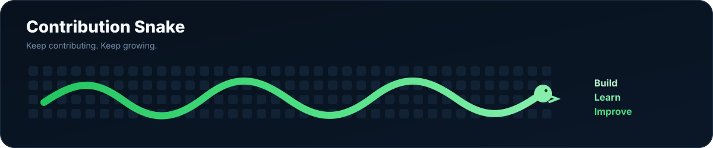
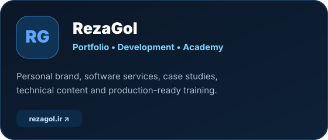
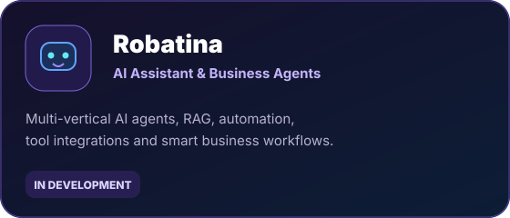
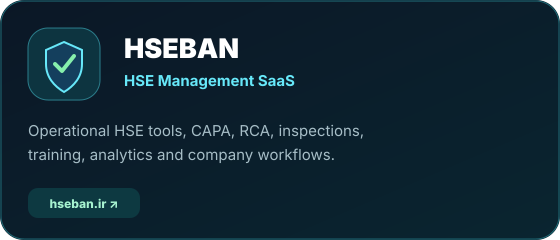
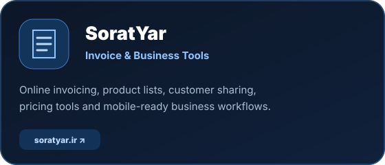
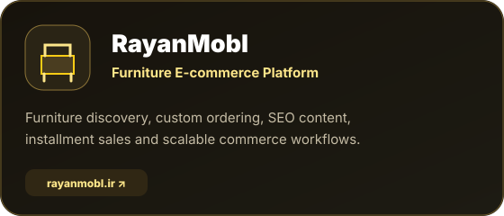

 

[🌐 **Website**](https://rezagol.ir) · [💼 **LinkedIn**](https://www.linkedin.com/in/reza-esmaeil-gol-610b1355) · [𝕏 **X / Twitter**](https://x.com/rezagol_ir) · [▶️ **YouTube**](https://www.youtube.com/@rezagol_ir) · [📷 **Instagram**](https://instagram.com/rezagol.ir)

## 👋 About Me

I'm **Reza Esmaeil Gol**, a full-stack web and mobile developer focused on turning real business problems into production-ready software.

- 🚀 I build products from **idea → architecture → UI/UX → development → deployment**.
- 🤖 I work on **AI assistants, agents, RAG, semantic search, automation and local/cloud model integration**.
- 🌐 I build **SaaS platforms, business dashboards, e-commerce systems and SEO-focused websites**.
- 📱 I develop **Android and cross-platform mobile applications** with Flutter, Kotlin and React Native.
- 🧩 I care about **scalable architecture, security, performance, product UX and business automation**.
- 🎯 Current direction: practical AI products that can connect to real tools, data and workflows.

> **Code today. Build something better tomorrow. 🚀**

---

## 🚧 Currently Building

**Robatina** is my current AI platform direction: one scalable core for intelligent assistants and business agents, with RAG, workflow automation, tool integrations and multiple vertical use-cases.

---

## 💻 Tech Stack

---

## 📊 Developer Snapshot

---

## 🧠 Primary Languages

---

## 🐍 Contribution Energy

---

## ⭐ Featured Products & Brands

<table>
<tr>
<td width="50%" valign="top">

</td>
<td width="50%" valign="top">

</td>
</tr>
<tr>
<td width="50%" valign="top">

</td>
<td width="50%" valign="top">

</td>
</tr>
<tr>
<td width="50%" valign="top">

</td>
<td width="50%" valign="top">

### 🔭 What I'm exploring next

- Multi-agent business automation
- Long-term memory for personal assistants
- Human approval + tool execution flows
- Local/cloud model routing
- AI-native CRM and commerce workflows
- Reliable mobile AI experiences

</td>
</tr>
</table>

---

## 🛠 What I Build

<table>
<tr>
<td width="25%" valign="top">

### 🌐 Web & SaaS
- Custom business platforms
- Admin dashboards & CRM
- Subscription & billing flows
- E-commerce systems
- SEO-focused websites

</td>
<td width="25%" valign="top">

### 📱 Mobile
- Android applications
- Flutter apps
- Kotlin apps
- React Native
- PWA / hybrid apps

</td>
<td width="25%" valign="top">

### 🤖 AI
- AI assistants & agents
- RAG & semantic search
- Local LLM integrations
- Workflow automation
- Tool-connected agents

</td>
<td width="25%" valign="top">

### 📈 Product
- MVP → production
- Architecture & UX
- SEO & analytics
- Business automation
- Performance tuning

</td>
</tr>
</table>

---

## 🔓 Public Repositories & Experiments

A few public repositories available from this profile:

- [`vertical-sidebar`](https://github.com/aradinan/vertical-sidebar) — UI / sidebar experiment
- [`Portfolio-website-multi-langual`](https://github.com/aradinan/Portfolio-website-multi-langual) — multilingual portfolio project
- [`wp-booster`](https://github.com/aradinan/wp-booster) — WordPress performance experiment
- [`testtestqom`](https://github.com/aradinan/testtestqom) — public development/test repository

Most commercial products and client systems are kept private.

---

## 🧭 Engineering Interests

`AI Agents` · `RAG` · `SaaS Architecture` · `Laravel` · `Next.js` · `React` · `Flutter` · `Kotlin` · `Python` · `SEO` · `Automation` · `E-commerce` · `Developer Tools`

---

## 🤝 Let's Connect

I’m open to **interesting products, collaborations, technical challenges and AI/SaaS opportunities**.

### [🌐 rezagol.ir](https://rezagol.ir)

[LinkedIn](https://www.linkedin.com/in/reza-esmaeil-gol-610b1355) · [X / Twitter](https://x.com/rezagol_ir) · [YouTube](https://www.youtube.com/@rezagol_ir) · [Instagram](https://instagram.com/rezagol.ir)

 

**Build useful things. Ship. Learn. Improve. Repeat.**

